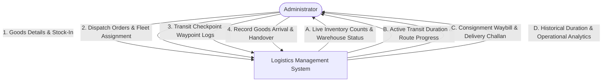
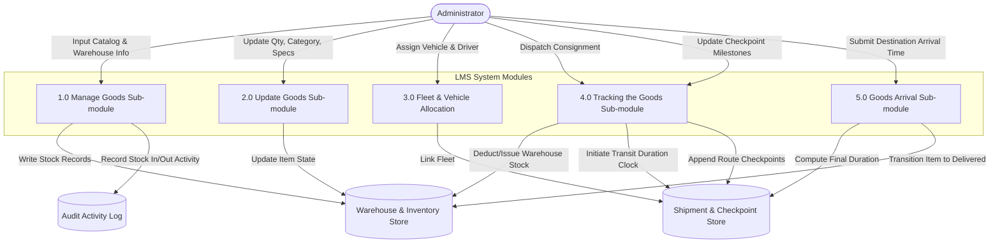
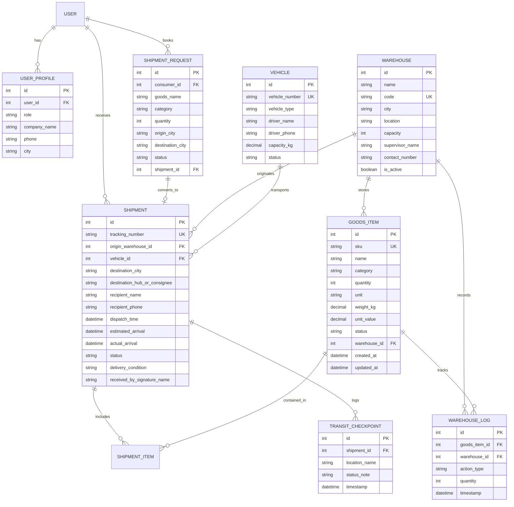

# Logistics Management System (LMS)
## Comprehensive Academic Project Report & Technical Documentation

---

### Executive Summary & Abstract
Logistics management is a cornerstone of supply chain management (SCM), designed to fulfill customer and market demands through systematic planning, execution, and real-time oversight of goods, services, and associated information from their origin to their final destination. In the absence of a computerized logistics system, logistics service providers encounter critical operational bottlenecks: customer service latency, escalated freight transportation costs, vulnerability during new product distribution, and lack of inventory visibility.

This project, **Logistics Management System in Python & Django**, provides a unified, web-based digital ecosystem featuring **Dual Integrated Portals (Logistics Provider Portal & Consumer / Client Portal)** backed by a real-time synchronized database. It encapsulates comprehensive features including Warehouse Management, Fleet & Driver Allocation, Consignment Booking Requests, Inventory Record Maintenance (goods available vs. issued), Dynamic Transportation Duration Tracking, Interactive Leaflet GPS Route Mapping, Automated Dispatch Invoicing, and Verified Goods Arrival Recording at destinations.

---

## 1. System Requirements Specification (SRS)

### 1.1 Hardware Requirements (Minimum & Recommended)
| Component | Minimum Specification | Recommended Specification |
| :--- | :--- | :--- |
| **Processor** | Intel Core i3 (2.0 GHz or higher) | Intel Core i5 / AMD Ryzen 5 or higher |
| **Primary Memory (RAM)** | 1.0 GB RAM | 4.0 GB – 8.0 GB RAM |
| **Storage (Hard Disk)** | 5.0 GB Free Space | SSD with 10.0+ GB Free Space |
| **Network Interface** | Standard Ethernet / 802.11 b/g/n Wi-Fi | High-speed Broadband Connection |
| **Display Resolution** | 1024 x 768 pixels | 1920 x 1080 pixels (Full HD) |

### 1.2 Software Requirements
| Component | Specification |
| :--- | :--- |
| **Operating System** | Windows XP, Windows 7 (Ultimate/Enterprise), Windows 10, Windows 11 |
| **Language Runtime** | Python 3.10 to Python 3.13+ |
| **Web Framework** | Django 5.x / 6.x |
| **Database System** | SQLite (Default embedded) / MySQL 8.0+ / MariaDB |
| **Frontend Technologies** | HTML5, CSS3 (Modern Vanilla Design System), ECMAScript 6 (JavaScript) |
| **Client Web Browser** | Google Chrome, Mozilla Firefox, Microsoft Edge, Safari |

---

## 2. Project Lifecycle: The Waterfall Model

As specified in the project engineering standard, this system is developed adopting the classic **Waterfall Model**. The Waterfall Model is a linear sequential flow in which progress cascades steadily downwards through the phases of software development:

```
[Phase 1: Requirement Analysis & Specification]
                    │
                    ▼
       [Phase 2: System & Database Design]
                    │
                    ▼
         [Phase 3: Implementation & Coding]
                    │
                    ▼
        [Phase 4: Verification & Integration Testing]
                    │
                    ▼
           [Phase 5: Deployment & Maintenance]
```

### Phase Breakdown:
1. **Requirements Analysis**: Detailed study of supply chain pain points, goods classification, warehouse stocking requirements, fleet management, and regulatory receipt formats.
2. **System Design**: Architectural partitioning into models (`Warehouse`, `Vehicle`, `GoodsItem`, `Shipment`, `TransitCheckpoint`, `WarehouseLog`), database normalization up to 3NF, and user interface wireframing.
3. **Implementation**: Building the Django backend, model-form validation, URL routing, business logic for transit duration, and modern responsive CSS front-end.
4. **Verification & Testing**: Executing automated unit test cases, form validation testing, regression testing, and verification of transit timer accuracy.
5. **Deployment & Operations**: Packaging dependencies into `requirements.txt`, automating database migrations, and configuring administrative superuser provisioning.

---

## 3. System Architecture & Data Flow

### 3.1 Data Flow Diagram (DFD Level 0 - Context Diagram)



### 3.2 Data Flow Diagram (DFD Level 1 - Subsystem Decomposition)



---

## 4. Entity-Relationship (ER) Diagram



---

## 5. Detailed Sub-Module Implementation

### 5.1 Admin Control & Authentication
- The system is placed under the sole authority of the **Administrator**.
- Features secure authentication using Django's PBKDF2 password-hashing algorithm with SHA256.
- Role-based session management prevents unauthenticated access to internal logistics records.

### 5.2 Manage Goods Sub-Module
- **Functionality**: Allows the Administrator to add new goods into designated warehouses, remove scrapped/damaged goods, and categorize cargo (Electronics, Pharmaceuticals, Automotive, FMCG, Textiles, Industrial Equipment).
- **Available vs. Issued Tracking**: Every item tracks whether it is currently `Available in Warehouse`, `Issued for Dispatch`, `In Transit`, or `Delivered`.
- **Automatic SKU Generation**: Generates unique identification codes (`GDS-XXXXXXXX`) for quick barcode scanning and physical inventory auditing.

### 5.3 Update Goods Sub-Module
- **Functionality**: Enables modification of item specifications, stock adjustments after physical counts, warehouse re-allocations, and packaging type revisions.
- **Audit Logging**: Any update triggers a persistent log entry in `WarehouseLog` documenting the quantity differential and timestamp.

### 5.4 Tracking the Goods Sub-Module
- **Transportation Duration Tracking**:
  $$\text{Duration} = T_{\text{evaluation}} - T_{\text{dispatch}}$$
  - For active consignments ($T_{\text{evaluation}} = T_{\text{current}}$), the system tracks real-time elapsed transit time.
  - The front-end renders a dynamic, second-by-second JavaScript countdown/elapsed timer.
- **Route Checkpoint Milestones**: Waypoints, state toll plazas, and security checkposts can be continuously appended with timestamp notes.

### 5.5 Goods Arrival Sub-Module
- **Functionality**: Upon vehicle touchdown at the destination hub/consignee, the Administrator updates the record with:
  - Exact arrival timestamp ($T_{\text{actual\_arrival}}$).
  - Condition of received cargo (`Intact`, `Minor Damage`, `Damaged / Discrepancy`).
  - Name and signature confirmation of the accepting recipient.
- **Duration Finalization**: Freezes total transit duration from departure to arrival and transitions the shipment and associated goods items to `Delivered`.
- **Fleet Release**: Automatically marks the assigned vehicle and driver status back to `Available` in yard.

---

## 6. Mathematical Model: Transit Duration Calculation

```python
def get_transit_duration(self):
    """
    Computes transportation duration according to project requirements:
    - In-transit shipments: elapsed time = now() - dispatch_time
    - Delivered shipments: elapsed time = actual_arrival - dispatch_time
    """
    end_time = self.actual_arrival if (self.is_delivered and self.actual_arrival) else timezone.now()
    delta = end_time - self.dispatch_time
    total_seconds = max(0, int(delta.total_seconds()))
    
    days = total_seconds // 86400
    hours = (total_seconds % 86400) // 3600
    minutes = (total_seconds % 3600) // 60
    seconds = total_seconds % 60
    
    parts = []
    if days > 0: parts.append(f"{days}d")
    if hours > 0 or days > 0: parts.append(f"{hours}h")
    parts.append(f"{minutes}m")
    
    return {
        'days': days, 'hours': hours, 'minutes': minutes,
        'seconds': seconds, 'total_seconds': total_seconds,
        'formatted': " ".join(parts) if parts else f"{seconds}s"
    }
```

---

## 7. Testing Plan & Verification Results

All automated unit tests are executed using Django's test runner framework (`django.test.TestCase`):

| Test Case ID | Test Objective | Input Data | Expected Output | Status |
| :--- | :--- | :--- | :--- | :--- |
| **TC-01** | Verify Goods Creation & SKU generation | Item name, warehouse, qty=100 | Item saved with `GDS-` prefix and Available status | **PASS** |
| **TC-02** | Test Dispatch & Stock Issuance | Dispatch 20 units of goods | Shipment created, status `Dispatched`, duration initialized | **PASS** |
| **TC-03** | Test In-Transit Elapsed Duration | Dispatch 5.5 hours ago | Duration calculates $\ge 5$ hours with formatted string | **PASS** |
| **TC-04** | Test Goods Arrival & Duration Lock | Dispatch 10h ago, Arrival 2h ago | Total duration calculates exactly `8h 0m`, status `Delivered` | **PASS** |
| **TC-05** | Audit Trail Verification | Add stock log entry | `WarehouseLog` record created linked to warehouse | **PASS** |
| **TC-06** | Dual Portal Authentication & Role Routing | Provider & Consumer credentials | Correct portal dashboard loaded; cross-role access guarded | **PASS** |
| **TC-07** | Client Booking & Provider Approval Sync | Consumer booking request #1 | Queued in Provider inbox; approval converts into active shipment | **PASS** |
| **TC-08** | Public Waybill Tracking & Enquiry Desk | Consignment number lookup | Real-time transit route shown; enquiry lodged to admin desk | **PASS** |
| **TC-09** | CSV Audit Log Streaming | Goods & transit export requests | RFC 4180 compliant CSV stream returned with headers | **PASS** |
| **TC-10** | Commercial Dealer / Provider Registration | Dealer business details & GSTIN | Dealer user registered, commercial profile saved, primary hub auto-provisioned | **PASS** |
| **TC-11** | Directed Consumer Booking & Multi-Dealer Isolation | Consumer targets Provider A | Booking appears in Provider A inbox, invisible to Provider B; approval preserves dealer FK | **PASS** |
| **TC-12** | Commercial Profile Update | Updated GSTIN, address, city | Profile changes persisted in relational database across portals | **PASS** |

---

## 8. Commercial Multi-Dealer Architecture

### 8.1 Provider (Dealer / Carrier) Onboarding & Provisioning
- **Self-Service Commercial Onboarding (`/provider/register/`)**:
  - Logistics operators register with trade metadata: Legal Entity Name, Operating Category (3PL, Fleet Carrier, Freight Forwarder, Distribution Hub), Tax Identification Number (GSTIN / VAT), and Primary Operating City.
  - **Automated Hub Provisioning**: Upon successful account creation, the system triggers database auto-provisioning of a dedicated primary logistics hub (`WH-[CITY]-[UUID]`) in the dealer's operating territory.
- **Provider Fleet & Inventory Ownership**:
  - Warehouses, fleet trucks, and inventory stock maintain a foreign key reference (`provider_id`) linking them directly to the managing carrier dealer.

### 8.2 Client / Consumer Registration & Directed Bookings
- **Client Enterprise Profile (`/consumer/register/`)**:
  - Consignees, retailers, and industrial enterprises maintain distinct business accounts equipped with commercial tax IDs and delivery addresses.
- **Directed vs. Open Network Booking Routing**:
  - Clients can select a specific preferred dealer from the certified provider network or broadcast their booking across the open logistics network.
  - Servicing carriers review and convert booking requests directly into scheduled shipments, seamlessly syncing tracking numbers, waypoints, and invoices to the booking client's personal tracking portal.

---

## 9. Advantages, Limitations & Applications

### 8.1 Advantages
- **Elimination of Paperwork**: Manages complete consignment manifests, gate passes, and inventory ledgers electronically.
- **Zero Manual Guesswork**: Eliminates manual logging of transit durations through automated timestamp differencing.
- **Real-Time Warehouse Visibility**: Provides up-to-the-minute visibility of goods in warehouses vs. goods issued in transit.
- **Resource & Labor Savings**: Streamlines consignment dispatch, checkpoint logging, and destination receipt generation.

### 8.2 Limitations
- **No In-Person Physical Inspection via Web**: Consignees cannot physically examine the goods inside the digital portal before delivery.
- **Limited Direct Human Interaction**: Addressed and resolved in Phase 2 through the integrated **Customer Enquiry & Support Desk Portal**, allowing consignees to submit real-time inquiries directly against tracking numbers.

### 8.3 Applications
- **Public & Commercial Freight Logistics**: Tracking inter-city container and truck freight.
- **Third-Party Logistics (3PL)**: Managing centralized and distributed warehousing hubs.
- **Industrial Supply Chain**: Tracking manufacturing raw materials from supplier depots to assembly lines.
- **E-Commerce Fulfillment**: Tracking regional fulfillment centers to delivery hubs.

---

## 9. Advanced System Enhancements Implemented

### 9.1 Interactive Geographic Route Mapping (Leaflet.js / OpenStreetMap)
Integrated an open-source mapping engine rendering interactive highway routes between origin warehouses and destination terminals:
- Waypoint milestone pins and custom SVG hub markers.
- Real-time animated vehicle position indicator interpolated along route polylines based on transit duration percentage.

### 9.2 Public Customer Self-Service Tracking Portal (`/track/`)
Enables end-users to query their consignments without administrative credentials:
- Displays live countdown/elapsed transit duration timers.
- Provides an integrated ticket submission interface (`CustomerEnquiry`) which directly alerts the administrator via automated notification events.

### 9.3 Scannable QR Codes & Consignment Waybills
Dynamic QR code generation embedded on every consignment delivery challan, allowing instantaneous barcode scanner or smartphone lookup.

### 9.4 Audit Data Export (CSV / Excel)
Native endpoints for streaming comprehensive inventory status (`/reports/export/goods/`) and historical transit duration analytics (`/reports/export/transit/`).

### 9.5 Operational Event Notifications Engine
Centralized event bus alerting administrators to consignment dispatches, milestone logging, destination handovers, and incoming customer inquiries.

---

## 10. Academic References
1. Texas Digital Library (SHSU) Supply Chain Management Research:  
   `https://shsu-ir.tdl.org/shsu-ir/bitstream/handle/20.500.11875/1164/0781.pdf?sequence=1`
2. IEEE Xplore Digital Library - Logistics Information Systems & Automated Cargo Tracking:  
   `https://ieeexplore.ieee.org/document/6208293/`
3. IEEE Xplore Digital Library - Supply Chain RFID and Electronic Tracking Architecture:  
   `https://ieeexplore.ieee.org/document/4679917/`
