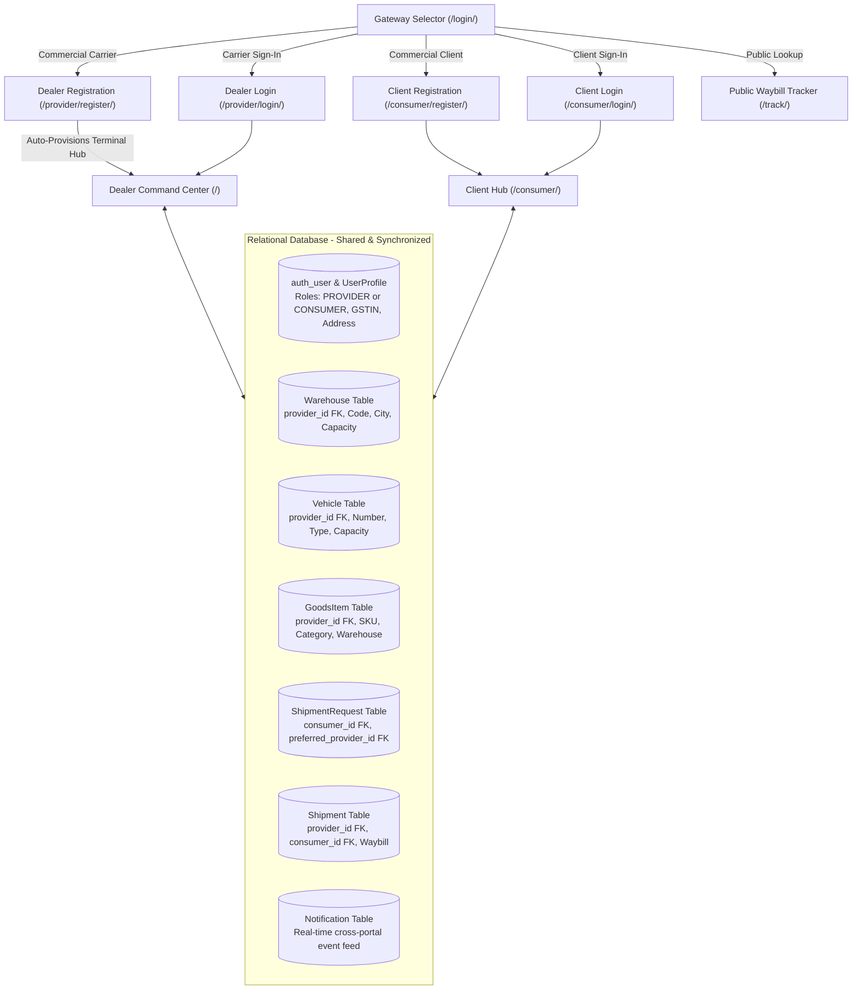

# 🚚 Logistics Management System (LogiTrack Pro)
### Enterprise-Grade Commercial Multi-Dealer & Consumer Logistics Ecosystem

[](https://www.python.org/)
[](https://www.djangoproject.com/)
[](https://docs.djangoproject.com/en/stable/ref/databases/)
[](https://github.com/)
[](LICENSE)

---

## 📖 Overview

**LogiTrack Pro** is a comprehensive, production-ready **Logistics Management System** built with **Python and Django**. It bridges the gap between **Logistics Service Providers / Carriers (Dealers)** and **Commercial Clients / Consignees (Consumers)** via synchronized dual portals powered by an ACID-compliant relational database.

The platform provides complete lifecycle management of freight operations: warehouse storage allocation, vehicle fleet dispatching, automated mathematical transit duration tracking, interactive Leaflet.js GPS mapping, digital e-Challan invoicing with QR codes, and destination goods arrival confirmation.

---

## 🌟 Key Architecture & Multi-Dealer Data Flow



---

## 🚀 Core Features

### 🏢 1. Commercial Dealer / Carrier Portal (`/provider/...`)
- **Self-Service Commercial Onboarding (`/provider/register/`)**:
  - Logistics carriers register with company name, category (3PL, Fleet Carrier, Express Cargo, Distribution Hub, Freight Forwarder), **Tax ID / GSTIN**, and operating city.
  - **Automated Facility Auto-Provisioning**: Upon sign-up, the system auto-provisions an active primary terminal hub (`WH-[CITY]-[UUID]`) in the dealer's operating territory.
- **Unified Command Center (`/`)**:
  - High-tech dark aesthetics with real-time KPI metrics: Available Stock, Active In-Transit Consignments, Delivered Goods, and Fleet Utilization.
- **Client Bookings Inbox (`/provider/requests/`)**:
  - Review client cargo booking requests directed to this carrier or open to the network.
  - One-click approval scheduling that allocates vehicles, links inventory, generates waybill tracking numbers, and dispatches cargo.
- **Fleet & Warehouse Management**:
  - Track vehicle maintenance status, driver contacts, payload capacities, and warehouse capacity utilization.
- **Commercial Profile Management (`/provider/profile/`)**:
  - Maintain corporate tax IDs, billing addresses, and facility headquarters.

### 📦 2. Commercial Client / Consumer Portal (`/consumer/...`)
- **Self-Service Client Registration (`/consumer/register/`)**:
  - Consignees, retailers, and industrial enterprises sign up with commercial trade categories, GSTINs, and delivery locations.
- **Personalized Inbound Cargo Hub (`/consumer/`)**:
  - Monitor all live incoming shipments booked by or destined for this client.
- **Direct Cargo Booking Engine (`/consumer/request/`)**:
  - Request freight transport with detailed cargo specs (category, quantity, unit, origin, destination, handling instructions).
  - Select a **Preferred Verified Carrier** from the live directory dropdown or broadcast across the open logistics network.
- **Interactive GPS Route Mapping**:
  - Live OpenStreetMap / Leaflet.js interactive maps showing origin hubs, destination pins, and dynamic vehicle position tracking along highway polylines.
- **Digital Consignment e-Challan & Invoice**:
  - Instant access to formal PDF/print-ready delivery challans with barcodes, QR codes, and carrier tax credentials.

### 🌐 3. Public Consignment Tracking (`/track/`)
- Unauthenticated public tracking portal for end-customers to search any waybill number (e.g., `LMS-260918-BOM781`).
- Second-by-second live transit duration clock.
- Direct customer enquiry desk (`/track/<waybill>/enquiry/`) that instantly alerts operations staff.

### ⏱️ 4. Mathematical Transit Duration Tracking Engine
- **In-Transit Consignments**: Dynamically computes elapsed travel time from dispatch timestamp ($T_{\text{now}} - T_{\text{dispatch}}$).
- **Delivered Consignments**: Freezes exact total duration ($T_{\text{arrival}} - T_{\text{dispatch}}$) upon verified recipient sign-off.

### 📊 5. Audit Logging & RFC 4180 CSV Exports
- **Automated Activity Logging**: Every stock addition, transfer, or consignment dispatch triggers an immutable audit log entry.
- **CSV Data Streaming**: Export full inventory records (`/reports/export/goods/`) and historical transit analytics (`/reports/export/transit/`).

---

## 🔑 Default Seed Accounts & Credentials

The repository includes an automated seeder (`seed_logistics_data`) populating realistic commercial entities:

| Portal | URL | Username | Password | Commercial Entity & Role |
| :--- | :--- | :--- | :--- | :--- |
| **Gateway Selector** | `/login/` | — | — | Visual gateway screen directing to Provider or Consumer |
| **Dealer Registration**| `/provider/register/` | Self-Service | User defined | Dealer onboarding with GSTIN & auto-provisioned hub |
| **Client Registration**| `/consumer/register/` | Self-Service | User defined | Client onboarding with business type & GSTIN |
| **Provider Portal** | `/provider/login/` | `provider` | `provider123` | BlueDart Express Logistics (GSTIN: `27AABCU9603R1ZM`) |
| **Consumer Portal** | `/consumer/login/` | `consumer` | `consumer123` | Reliance Retail Distribution (GSTIN: `27AAACR1234A1Z9`) |
| **Superadmin Portal**| `/provider/login/` | `admin` | `admin123` | Full System Administrator with Django Admin access |
| **Public Tracker** | `/track/` | Public | No Login | Instant waybill lookup & customer support ticket submission |

---

## 🛠️ Installation & Local Setup

### Prerequisites
- Python 3.10, 3.11, 3.12, or 3.13
- Git

### 1. Clone the Repository
```bash
git clone https://github.com/abhishek947kumar/Logistics-Management-System.git
cd Logistics-Management-System
```

### 2. Create and Activate a Virtual Environment

**Windows (PowerShell):**
```powershell
python -m venv venv
.\venv\Scripts\Activate.ps1
```

**Linux / macOS:**
```bash
python3 -m venv venv
source venv/bin/activate
```

### 3. Install Dependencies
```bash
pip install -r requirements.txt
```

### 4. Apply Database Migrations
```bash
python manage.py migrate
```

### 5. Seed Realistic Commercial Demo Data
```bash
python manage.py seed_logistics_data
```

### 6. Start the Development Server
```bash
python manage.py runserver
```

Open your browser and navigate to:
👉 **[http://127.0.0.1:8000/](http://127.0.0.1:8000/)**

---

## 🧪 Running the Automated Test Suite

LogiTrack Pro includes a test suite covering models, commercial registration, multi-dealer isolation, duration math, and public tracking:

```bash
python manage.py test
```

### Test Suite Execution Output:
```
Creating test database for alias 'default'...
............
----------------------------------------------------------------------
Ran 12 tests in 61.725s

OK
Destroying test database for alias 'default'...
Found 12 test(s).
System check identified no issues (0 silenced).
```

---

## 📂 Project Structure

```
Logistics-Management-System/
├── logistics_system/               # Django Project Core Configuration
│   ├── __init__.py
│   ├── settings.py                 # 12-factor settings (os.getenv support)
│   ├── urls.py                     # Root URL routing & app delegation
│   ├── asgi.py
│   └── wsgi.py
├── logistics_app/                  # Core Logistics Application
│   ├── admin.py                    # Django Admin customization & filters
│   ├── decorators.py               # Role-based access control (@provider_required, @consumer_required)
│   ├── forms.py                    # Commercial forms with GSTIN & business validation
│   ├── models.py                   # Warehouse, Vehicle, GoodsItem, Shipment, Checkpoint, Request, Log
│   ├── tests.py                    # 12 comprehensive unit and integration tests
│   ├── urls.py                     # Sub-routes for provider, consumer, tracking, and reports
│   ├── views.py                    # Full business logic & portal workflows
│   ├── migrations/                 # Database schema migration history
│   └── management/commands/        # Data seeding management command (seed_logistics_data)
├── static/
│   ├── css/                        # Custom Vanilla CSS Design System (Glassmorphism, Dark/Light modes)
│   └── js/                         # Real-time transit timers, dynamic filters, interactive map logic
├── templates/logistics/            # HTML5 Semantic UI Templates
│   ├── base.html                   # Provider Command Center layout
│   ├── consumer_base.html          # Consumer Portal layout
│   ├── portal_select.html          # Gateway selector screen
│   ├── provider_login.html         # Dealer authentication
│   ├── provider_register.html      # Dealer onboarding form
│   ├── consumer_login.html         # Client authentication
│   ├── consumer_register.html      # Client onboarding form
│   ├── dashboard.html              # Provider Operations Dashboard
│   ├── consumer_dashboard.html     # Client Tracking Hub
│   ├── tracking_detail.html        # Interactive GPS Route & Timeline
│   ├── challan_invoice.html        # Official delivery e-Challan with QR code
│   └── ...                         # Warehouse, vehicle, goods, and enquiry templates
├── .env.example                    # Environment variable template
├── .gitignore                      # Comprehensive Python & Django gitignore
├── LICENSE                         # MIT License
├── manage.py                       # Django CLI entrypoint
├── PROJECT_REPORT.md               # Comprehensive Academic & Waterfall Lifecycle Report
├── README.md                       # Repository Documentation
└── requirements.txt                # Python package dependencies
```

---

## 📄 Academic & Technical Documentation

For in-depth mathematical models, entity-relationship diagrams (ERD), Level 0/1 Data Flow Diagrams (DFD), and Waterfall SDLC phases, refer to:
📑 **[PROJECT_REPORT.md](PROJECT_REPORT.md)**

---

## 📜 License

This project is open-source and distributed under the **[MIT License](LICENSE)**.

---

## 👤 Author
- **Abhishek Kumar**
- GitHub: [@abhishek947kumar](https://github.com/abhishek947kumar)
